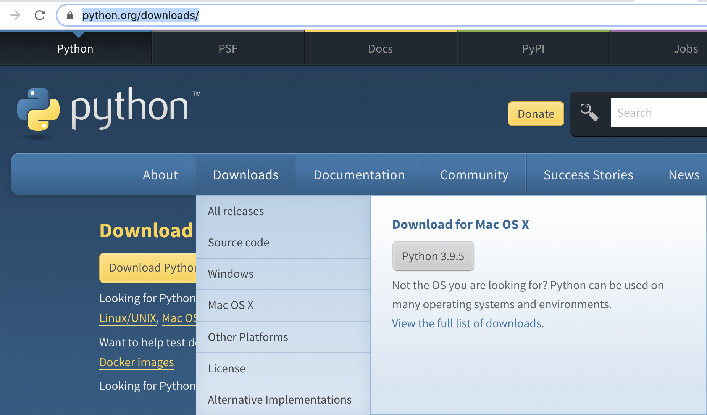
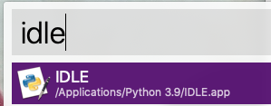
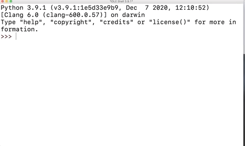

# 🚩 파이썬 그냥 재미로 소개

프로그래밍을 배울 때 **가장 좋은 방법**은 무엇일까요?

그것은 프로그램을 **직접 만들어 보는 것**입니다.

예전에 C, C++, 자바와 같은 프로그램을 만들기 위해서는 알아야하는 것들이 많았습니다.
하드웨어, 메모리, 컴파일, 빌드등 생소한 용어들부터 접하게 되는게 일반적이지요.


하지만! 파이썬은 교육용 언어로 설계되었기 때문에 코드가 간결하고 이해하기도 쉽습니다.
프로그래밍을 공부하기에 너무나 좋은 언어이지요. 코드를 작성하는 것 이외의 것을 몰라도 프로그램을 간단하게 작성하고, 간편하게 실행할 수 있습니다!

이러한 파이썬의 매력에 빠진 개발자인 제가 파이썬을 더 널리 알려드리기 위해 **파이썬 그냥 재미로** 강의를 준비하였습니다. 파이썬을 설치하는 법부터 차근 차근 실제로 써먹을 수 있는 프로그램을 만들 수 있을 때까지 안내해드리겠습니다.

## 📚 파이썬을 배우면 뭐가 좋은가요?


`제 4차 산업혁명`이라는 말들을 들어보셨을겁니다. 4차 산업혁명은 다름아닌 데이터의 혁명입니다. 데이터를 잘 다루기 위해서는 컴퓨터에게 일을 시키는 법을 아는 것이 필수인데요. 컴퓨터에게 일을 시키는 방법은 바로 프로그래밍을 통해서 컴퓨터와 대화하는 것입니다. 컴퓨터와 대화를 하는 언어중에서도 가장 쉬운 언어는 단연코 `파이썬` 이라고 할 수 있습니다.


컴퓨터가 내 맘대로 동작하지 않을 때 답답하지 않으셨나요? `파이썬`을 배우면 그 답답한 마음이 해소 될 것입니다.


프로그래밍을 사용해서 IT세상의 숨겨진 기능. **개발자에게만** 공개된
기능들을 사용할 수 있는 능력을 얻게 됩니다. 함께 시작해봐요.

## 🤷‍♂️ 왜 그냥 재미로 인가요?

제가 20살에 프로그래밍을 처음 학부에서 1학기를 들은 다음의 과제가 게임을 만드는 것 이었습니다. 저는 전공자가 아닌데다, 학기의 중간 이후부터는 모르는 말이 너무 많이 나와서 과제를 할 수 없다고 생각을 했었습니다. 그런데 교수님이 과제를 내지 않으면 `F`라고 하셔서 울며 겨자먹기로 모르는 상태에서 시작을 했고, 딱 3주만에 과제를 만들어서 제출 할 수 있었습니다. 이 때 이후로 저는 막연한 상황에도 무슨 과제든 할 수 있다는 자신감을 얻게 되었습니다.

`그냥` 이라는 말은 저처럼 막연하고 모르더라도 시작을 해보시라는 의미가 담겨 있습니다.
그리고 시작을 해서 조금씩 프로그램을 하나씩 만들어 가는 과정은 `재미`가 있습니다.

여러분도 저와 같은 경험을 하실 수 있으면 좋겠다는 마음에서 `그냥 재미로`라는 이름을 붙이게 되었습니다. 프로그래밍이 처음이신 분들도 함께 재미있게 프로그래밍을 경험해보셨으면 좋겠습니다.

## 👨🏻‍💻지식공유자 소개


안녕하세요. 저는 2008년 부터 개발을 시작한 14년차 개발자 `박승규`라고 합니다.
웹개발, 플랫폼 개발, 게임서버개발, 인프라관리등 다양한 경험을 가지고 있으며,
현재는 카카오 엔터테인먼트에서 백오피스, CRM툴등의 개발을 맡아서 하고 있습니다.

파이썬은 2011년 부터 사용했는데요. 그때부터 파이썬의 팬이 되어서 열심히 사용하다가 현재는 파이썬을 본업으로 개발하고 있습니다.

### 간단한 이력 소개

- 현) 카카오 엔터테인먼트
- 전) 트리노드 (포코팡 개발사)
- 전) NHN JAPAN

## 💡시작하기

우선 파이썬을 설치해보세요.

[파이썬 공식 홈페이지](https://www.python.org/downloads/)에서 다운 받으실 수 있습니다. `파이썬 그냥 재미로` 강의에서는 최신버전(3.9.x)을 설치한후 강의를 진행하게 됩니다.



설치과정은 아래 인프런의 영상을 참고해주세요~

- [파이썬 설치하기 : 윈도우](https://www.inflearn.com/course/%ED%8C%8C%EC%9D%B4%EC%8D%AC-%EA%B7%B8%EB%83%A5-%EC%9E%AC%EB%AF%B8%EB%A1%9C/lecture/60771?tab=curriculum)

- [파이썬 설치하기 : 맥](https://www.inflearn.com/course/%ED%8C%8C%EC%9D%B4%EC%8D%AC-%EA%B7%B8%EB%83%A5-%EC%9E%AC%EB%AF%B8%EB%A1%9C/lecture/60773?tab=curriculum)

## 🐍 파이썬 실행해보기

파이썬을 설치하셨으면 이제 파이썬을 실행해볼까요?
파이썬을 실행하는 방법은 여러가지가 있습니다만, 파이썬 공식 홈페이지에서 파이썬을 설치하면 `IDLE` 이라는 프로그램이 같이 설치되게 됩니다.



### idle을 사용해서 파이썬 테스트 하기

`idle` 에서 아래와 같이 타이핑을 쳐보세요.

아래 화면과 같이 나오면 정상입니다!

```python
print("hello~")

1 + 233

import sys
sys.version
```



### 파이참(pycharm) 설치

어떤 작업을 할때 무슨 도구를 쓰는지는 매우 중요합니다. `장인은 도구를 가리지 않는다.` 라는 말이 있습니다만, 장인이 가지고 다니는 도구들은 보통 매우 잘 다듬어진 좋은 도구들이죠.

파이썬을 잘 사용하기 위한 좋은 도구들이 많습니다만, 그중에서 저는 [pycharm](https://www.jetbrains.com/ko-kr/pycharm/download/) 을 추천 드리고 싶습니다.

제가 아는한 가장 간단하게 파이썬 개발 환경을 설정해주는 툴입니다.

[파이참 홈페이지](https://www.jetbrains.com/ko-kr/pycharm/download)에 가셔서 다운 받은후 설치해보세요.

파이참을 설치하는 방법도 인프런에 올라와 있습니다. 참고해주세요.

[파이참 설치하기 - 윈도우](https://www.inflearn.com/course/%ED%8C%8C%EC%9D%B4%EC%8D%AC-%EA%B7%B8%EB%83%A5-%EC%9E%AC%EB%AF%B8%EB%A1%9C/lecture/76288?tab=curriculum)

[파이참 설치하기 - 맥](https://www.inflearn.com/course/%ED%8C%8C%EC%9D%B4%EC%8D%AC-%EA%B7%B8%EB%83%A5-%EC%9E%AC%EB%AF%B8%EB%A1%9C/lecture/62351?tab=curriculum)

## ✅ 마무리

위의 과정들을 잘 따라 하셨다면, 이제 `파이썬`과 `파이참`이 설치가 되어 있을 것입니다.
이제 파이썬을 배울 준비가 다 되었습니다. 이제 부터 차근 차근 파이썬을 함께 알아가보도록 합시다.

준비되셨으면 [섹션1-프로그래밍의 재료들|파이선의 내장 자료형](section1/python-data-type)으로 이동합시다.
