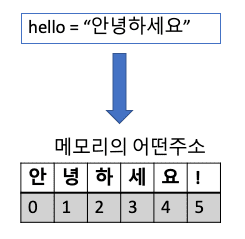

# 파이썬의 데이터 타입

export const Highlight = ({children, color='#1877F2'}) => (
<span
style={{
      backgroundColor: color,
      borderRadius: '2px',
      color: '#fff',
      padding: '0.25rem',
      borderRadius: '10px'
    }}>
{children}
</span>
);

## 파이썬 프로그램의 재료들

무언가를 만들려면 재료가 있어야 합니다.
아주 간단한 요리인 라면을 끓일려고 마음 먹었다 하더라도
물, 면, 스프는 있어야 라면을 만들어 먹을 수 있죠.

아주 간단한 프로그래밍인 파이썬으로 무언가를 만들려면 필요한 재료는 무엇일까요?

최소한 `데이터`, `변수`, `연산자` 이렇게 3가지가 필요합니다.

파이썬에 익숙해지는 방법중에 한가지는 파이썬을 계산기로 사용하는 것입니다..
아래 코드는 1 + 2를 파이썬으로 옮겨 본 것 입니다.

```mdx title="데이터, 변수, 연산자"
a = 1 # (1)
b = 2 # (2)
a + b # (3)
```

위 코드에 대한 설명은 아래와 같습니다.

```
(1) a에 1이라는 숫자를 할당
(2) b에 2라는 숫자를 할당
(3) a 와 b를 + (더하기) 연산으로 더함
```

여기서 a,b는 `변수` 1, 2는 `데이터`, '+'는 `연산자` 입니다.

:::caution

a = 1 의 뜻이 a 와 b가 같다라는 뜻이아니라
**1을 a에 할당한다**. 라는 뜻임을 주의해주세요.

:::

위에서 말한 재로들에 대해서 하나씩 알아보도록 할까요?

## 변수

변수부터 알아보도록 하겠습니다. `변수`를 풀어서 설명하면 `변하는 수` 라는 뜻입니다. 아래와 같은 문장이 있다고 해보겠습니다.

안녕하세요. 저는 <Highlight >승귤</Highlight>입니다.

생일은 <Highlight >10월 11일</Highlight>이고, 사는 곳은 <Highlight>성남</Highlight>입니다.

취미는 <Highlight >기타연주</Highlight>이며 <Highlight >개발자</Highlight>로 일하고 있습니다.

파란색으로 표시한 단어들은 다른 것으로 바꿔 쓸 수 있는 단어들인데, 이렇게 바꿀 수 있는 요소들을 **변수**로 표현하게 됩니다. 좀 더 프로그래머스러운 문장으로 바꿔볼까요?

안녕하세요. 저는 <Highlight >{name}</Highlight>입니다.

생일은 <Highlight >{birhday}</Highlight>이고, 사는 곳은 <Highlight>{address}</Highlight>입니다.

취미는 <Highlight >{hobby}</Highlight>이며 <Highlight >{job}</Highlight>로 일하고 있습니다.

위 문장을 파이썬 코드로 나타내면 아래와 같이 쓸 수 있습니다.

```python
# 1) 변수에 값을 할당
name = "승규"
month = 10
day = 11
address = "성남"
hobby = "기타연주"
job = "개발자"


# 2) print문으로 출력해보기
print(f"""안녕하세요. 저는 {name}입니다.
생일은 {month}월 {day}일이고, 사는 곳은 {address}입니다.
취미는 {hobby}이며 {job}로 일하고 있습니다.""")
```

1. 항목에서는 각각의 변수에 값들을 할당하고 있습니다.
2. 여기서는 `print` 함수가 나오는데요. 나중에 자세히 배우겠지만, print문은 출력창에 함수의 인자로 받은 내용을 출력하는 역활을 합니다.

아래와 같은 방법으로 사용이 가능합니다.

```python
print(변수1, 변수2, ... 변수n)
```

쌍따옴표 3개(""") 로 감싸져 있는것은 문자열입니다. 개행을 별도로 표기하지 않고 싶을 때 사용합니다. 그리고 `f`는 f-string 이라는 기능을 사용하기 위해서 붙입니다. 변수를 문자열 내부에 중괄호 `{}` 로 감싸서 넣기 위해서 사용합니다.

처음 부터 너무 많은 내용이 나왔나요? 😅
차근차근 하나씩 알려드릴 테니 너무 걱정마시고 따라오시면 됩니다. 😄

위 예제의 출력값은 아래와 같습니다. 파이참을 켜셔서 실행 ▶️ 을 한번 해보세요!

```
안녕하세요. 저는 승규입니다.
생일은 10월 11일이고, 사는 곳은 성남입니다.
취미는 기타연주이며 개발자로 일하고 있습니다.
```

:::info 실습해보기
변수의 값에는 여러분의 {이름} {생일} {주소} {취미} {직업}을 넣어서
실행해보세요~!
:::

## 내장 자료형 (built-in data types)

위에서는 변수에 대해서 알아보았습니다. 이번에는 파이썬의 내장 자료형에 대해서 알아볼게요!

자료는 `데이터(data)`이구요 형은 `타입(type)` 입니다. 즉 자료형은 다른말로 **데이터 타입**이라고 합니다. 개발자들은 보통 데이터 타입으로 소통을 해요! 그래서 저도 앞으로는 데이터 타입으로 이야기를 하려고 합니다.

파이썬은 기본적인 데이터 타입을 내장하고 있는데요. 크게 분류하면 `숫자, 문자, 불리언` 딱 3종류입니다.

숫자는 또 3가지로 분류할수 있는데요. 정수, 실수, 복소수가 있습니다.
저희는 정수와 실수만 알아보도록 하겠습니다.

코드를 보기에 앞서서 `type` 이라는 함수를 먼저 소개해드리겠습니다.
type 함수는 `type(값)`으로 실행할 수 있고, 값의 타입을 리턴해줍니다.

그래서 어떤 특정값의 타입을 출력창에서 보고 싶다면 `print(type(값))` 이렇게 하면 됩니다.

<Highlight>백문이불여일타!</Highlight>라는 말이 있습니다.

실습을 통해서 알아보도록 하죠.

### **정수 타입**

```python
print(type(42))
------------------------
실행결과
<class 'int'>
```

class 'int'라는 결과값이 있습니다. class는 나중에 배웁니다만, 데이터의 타입을 정의하는 키워드라고 생각해주시면 됩니다. 그뒤에 'int' 가 있는데요. 이는 interger 의 약자로 `정수`를 의미합니다.

### **실수 타입**

```python
print(type(42))
------------------------
실행결과
<class 'float'>
```

실수타입은 결과가 'float' 로 되어 있는데, 이는 float point의 줄임말입니다. 우리말로는 부동소수점(浮動小數點, floating point)이라는 뜻입니다. 소수점이 둥둥 떠다닌다는 의미라서 부동소수점입니다. 프로그래밍에서 **실수를 표현하기 위해** 사용합니다. 더 자세한 설명이 필요하신 분은 [위키](https://ko.wikipedia.org/wiki/%EB%B6%80%EB%8F%99%EC%86%8C%EC%88%98%EC%A0%90)를 참고해주세요~

### **문자열 타입**

```python
print(type("안녕하세요!"))
------------------------
실행결과
<class 'str'>
```

문자열 타입은 결과가 'str'로 `string`의 약자입니다. 일반적인 용어로는 `끈`으로 해석을 합니다만, 프로그래밍에서는 `문자열`이라고 부릅니다. 왜 그런지는 아래 **tip**을 참고 해주세요.

:::tip tip : string은 왜 문자열이라 부를까?



컴퓨터는 여러개의 문자를 하나씩 쪼개서 메모리의 특정 영역에 한칸씩 넣습니다. 위의 그림에서처럼 `안녕하세요!` 를 쪼개서 안|녕|하|세|요|! 이렇게 구분해서 넣어두었지요~
지금은 예시로든 문자열이 짧습니다만, 100자만 넘어가도 `길~~게` 선처럼 보일것입니다. 이에 프로그래밍에서는 문자열(즉, 문자들이 늘어선것이죠)을 string이라고 부릅니다.
:::

### **불리언 타입**

불리언은 참/거짓을 판별하는 논리를 위한 자료형입니다.

불리언은 `True` 또는 `False` 값만 가지게 됩니다. 첫글자가 대문자인 것에 주의해주세요. 파이썬에서 `True`와 `False`는 참과 거짓을 표현하는 문자로 미리 등록이 되어 있습니다.

참고로 불리언이라는 말은 영국의 수학자인 `조지불`에서 따온 것입니다. 더 궁금하신 분은 [위키](https://ko.wikipedia.org/wiki/%EB%B6%88%EB%A6%AC%EC%96%B8_%EC%9E%90%EB%A3%8C%ED%98%95)를 참고해주세요!

자 그럼 코드를 실행해서 타입을 알아봅시다.

```python
print(type(True))
print(type(False))
------------------------
실행결과
<class 'bool'>
<class 'bool'>
```

타입에 `True`, `False` 를 넣었는데 bool 이라고 나오고 있습니다.
나중에 조건문을 배우게되면 참거짓을 판별하기위해 불리언 타입이 필요하게 됩니다.
파이썬으로 개발을 하는동안 계속해서 나오게 되는 자료형이니 기억을 해두시면 좋습니다.

## 주석 (comment)

파이썬 코드는 파이썬 인터프리터가 컴퓨터가 알아들을 수 있는 언어로 변경해서 전달을 해주게 됩니다. 파이썬 인터프리터는 코드를 위에서 아래로 읽어서 해석을 합니다.

이 때 코드작성자가 컴퓨터에 전달하는 것이 아니라 자신 또는 코드를 읽는 다른 사람을 위해 메모를 남길 수 있는 기능이 바로 `주석` 기능입니다.

파이썬에서 주석은 한줄짜리 주석과 여러줄 짜리 주석이 있습니다.

한줄짜리 주석은 단순하게 가장 앞에 `#` 을 붙이면 됩니다.

```python
# 주석입니다.
# 1 + 1
# 위 코드는 실행되지 않습니다.
```

여러줄 주석은 쌍따옴표 3개 혹은 홑따옴표 3개로 감싸면 됩니다.
위에서는 주석을 3줄을 쓰기위해 앞에 `#`을 붙여줬습니다만, 여러줄 주석은 따옴표로 감싸주면 됩니다.

```python
"""여러줄 주석입니다.
print("안녕하세요")
위 코드는 실행되지 않습니다.
"""
```

혹은 홑따옴표 3개로 감싸도 됩니다.

```python
'''홑따옴표를 사용한 여려줄 주석입니다.
print(type("test"))
위 코드는 실행되지 않습니다.
'''
```

:::tip
홑따옴표로 감싸는것과 쌍따옴표로 감싸는 것은 전혀 차이가 없습니다.
다만 문자열에 쌍따옴표나 홑따옴표가 있는 경우에 겹치지 않게 사용하면 됩니다.

```python
print("Hi! I'm Seungkyoo")
---------------------------------
실행결과
Hi! I'm Seungkyoo
```

위 코드를 보면 중간에 `'` 이 있기 때문에 쌍따옴표로 감싸고 있습니다.
부득이 하게 못쓰는 경우에는 아래와 같이 역슬래시 `\`를 따옴표 앞에 사용하면 됩니다.

```python
print('hello! He\'s hat is cool')
---------------------------------
실행결과
hello! He's hat is cool
```

:::
