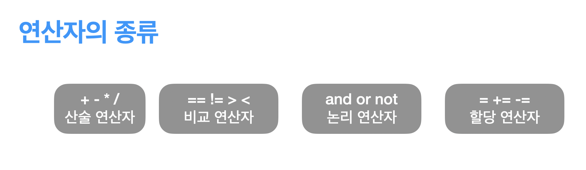

# 산술 연산자

모든 프로그래밍 언어는 `연산자`라는 기능을 제공합니다.

연산자는 `산술 연산자`, `비교 연산자`, `논리 연산자`, `할당 연산자` 가 있습니다.



산술 연산자는 덧셈, 뺄셈, 곱셈, 나눗셈과 더불어 나머지 연산, 거듭제곱 연산이 있는 연산자입니다.

더하기, 빼기, 곱하기, 나누기, 나머지, 거듭제곱을 차례대로 알아보겠습니다.

:::info
이제부터 나오는 예제 코드는 간단하지만, 연산자에 익숙하지 않으시다면 꼭 따라해보시는 것을 추천드립니다.
:::

### 더하기

일반적으로 더하기는 숫자에 적용됩니다.
`더할 수 있는 값` + `더할 수 있는 값` 을 하면 더해진 결과가 값으로 나오게 됩니다.
더하기를 할 수 있는 타입으로는 **숫자**가 대표적입니다. 그리고 **문자열**도 더하기를 할 수 있고, 나중에 배우게 됩니다만, **리스트**도 더하기를 할 수 있습니다.

지금은 더하기 연산자에 대해 배우고 있으니 숫자끼리 더하기 연산을 해보도록 하겠습니다.
예를 들어 a에 100이라는 값을 할당하고 b에 200을 할당한후 a + b 를 하면 300이 결과값으로 나오게 됩니다. 아래에는 예제 코드를 작성해두었습니다. 따라해보세요~

```python
a = 100
b = 200

print(a + b)
------------------
# 결과값
300
```

### 빼기

빼기도 더하기와 같이 숫자에 빼기를 하면됩니다.
더하기와 다른점으로 문자와 리스트에 빼기 연산은 가능하지 않습니다.

이번에도 숫자끼리 빼보도록 하겠습니다.

```python
a = 100
b = 200
print(a - b)
---------------------
# 결과값
-100
```

### 곱하기

곱하기도 알아보도록 하겠습니다. 곱하기도 숫자끼리 하는 것이 일반적입니다.
다만 우리가 알고 있는 수학에서의 곱하기 기호는 'X' 인데 반해, 프로그래밍에서는 `*` (스타 혹은 애스터리스크라고 발음합니다.)를 곱하기 연산자의 기호로 사용합니다.

빼기와는 다르게 `문자열` _ 숫자 는 성립하며, `리스트` _ 숫자 도 성립을 하게됩니다.
역시나 이번에는 숫자 \* 숫자를 알아보도록 하겠습니다.

```python
a = 100
b = 200
print(a * b)
------------------
# 결과값
20000
```

### 나누기

파이썬에서 나누기 연산자는 두가지가 있습니다. 하나는 나머지를 같이 출력하는 연산자 `/` 이고 다른 하나는 나머지를 버리는 연산자인 `//` 가 있습니다. 나머지는 문자열 혹은 리스트에 사용할 수 없고 숫자 타입에만 사용이 가능합니다. `/`를 사용하는 예제와 `//`를 사용하는 예제를 하나씩 살펴 보도록 하겠습니다.

```python
a = 10
b = 3
print(a/b)
-------------------------
# 결과값
3.3333333333333335
```

위 예제에서는 나머지를 버리지 않았기 때문에 `3.3333333333333335` 이라는 수가 나오게 됩니다. 수학의 세계라면 무한 소수가 나와야 겠지만, 컴퓨터에서 소수점이하 계산은 오차를 허용하기 때문에 적당히 나오다가 마지막에 5라는 값이 나오게 되었습니다. 이는 버그는 아니며 의도된 동작입니다. 왜 그런지 궁금하신 분은 부동소수점에 대해서 알아보시면 됩니다.

`//`는 나머지를 버리는 연산이라고 알려드렸습니다. 아래 예제에서 다시 확인해보도록 하겠습니다.

```python
a = 10
b = 3
print(a // b)
----------------------------
# 결과값
3
```

`/`연산과는 다르게 소수점 이하 자리수를 버리고 `3`이 결과값으로 나오게 되었습니다.
필요에 따라 잘 구분하여 쓰는 것이 중요하겠습니다.

### 나머지

사칙연산은 대부분 알고 있는 연산자입니다만, 프로그래밍에서는 나머지 연산자도 자주사용하게 됩니다. 예를 들어 홀수 인지 짝수인지 판별하는 프로그램을 만들고 싶을 때 2로 나눈 나머지가 0이면 짝수 아니면 홀수 라고 할 수 있을 것입니다.

이런 경우에 간단하게 사용할 수 있는 연산자가 `%` 연산자 입니다.

`a % b`를 하면 a를 b로 나눈 나머지를 결과값으로 주게 됩니다.

역시나 예제로 알아보도록 하겠습니다.

```python
a = 123
b = 2
print(a % b) # 결과값 1

c = 234
print(c % b) # 결과값 0
```

### 거듭제곱

산술연산자에서는 마지막으로 거듭제곱시에 사용하는 연산자인 `**`을 소개해드리겠습니다.
곱하기 기호가 두번있으니 거듭제곱을 하는 의미와 통하는 것 같습니다.

이제 2의 10승을 파이썬 프로그래밍으로 구해보도록 하겠습니다.

```python
a = 2
b = 10

print(a ** b)
----------------------
# 결과값
1024
```

### 마무리

지금까지 산술연산자들에 대해 소개해드렸습니다. 쉬운만큼 정말로 자주사용하게 되는 연산자들이니 필요할 때 찾아서 쓰는 것이 아니라 체득하여 적재적소에 필요시 검색없이 사용할 수 있도록 연습하는것이 중요합니다!
