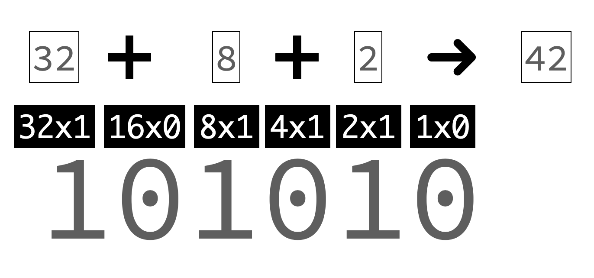

# 비트연산자

우선 비트(bit)가 무엇인지 부터 설명을 드리겠습니다.

## 비트란 무엇인가?


32비트 컴퓨터, 64비트 컴퓨터 이런말을 들어보신적이 있을 것입니다. 그렇지만, 비트가 무엇인지 말하려고 하면 쉽지 않을 것입니다.

그래서 우선 비트가 무엇인지 부터 말씀을 드리고 시작하겠습니다.

`비트(bit)`는 **데이터를 나타내는 최소단위**로 0과 1로만 구성이 되어 있습니다. 이진수를 나타내는 binary와 숫자를 말하는 digit을 합쳐서 bit라고 부르고 있습니다.

컴퓨터는 0과 1이라는 값을 가지고 모든 연산을 수행하기 때문에 `비트`는 굉장히 중요한 개념입니다만, 2진수로 사고를 해야하기 때문에 쉽지는 않습니다. 이에 본 문서에서는 비트연산이 이런것이구나 정도만 짚어보고 가도록 하겠습니다.

위에서 비트(bit)가 무엇을 말하는지 알아보았습니다. 비트 연산이라고 하는것은 2진수를 가지고 계산을 하는 것을 의미합니다. 우리가 알고 있는 10진수의 계산과는 약간 다른 부분들이 있으니 주의 깊게 보실 필요가 있습니다.

우선 파이썬을 사용하여 42라는 숫자를 2진수로 변경해보도록 하겠습니다.

```python
print(bin(42))
# 0b101010
```

위의 코드에서 `bin`이라는 함수를 사용했습니다. 이 함수는 숫자를 2진수로 변경하는 일을 합니다.

코드를 실행해보신 분은 아시겠지만, 결과 값으로 `0b101010` 이라고 나오게 됩니다.
여기서 앞의 두자리 `0b`는 2진수 데이터임을 의미하는 문자입니다.

그리고 뒤에 `101010`은 이진수입니다. 42를 이진수로 바꾼 표현이지요.



어떻게 해서 42가 101010이 되었는지는 위의 그림을 보시면 알 수 있습니다.
10진수는 자리수가 바뀌면 10을 곱하게 되는데, 2진수는 자리수가 바뀌면 2를 곱하게 됩니다. 그래서 100000 은 32가 되는 것이고, 1000은 8, 10은 2가 되는 것입니다.
각각을 더하면 101010이고, 10진수로는 42이가 되는 것입니다.

## 비트 연산자

비트가 무엇인지에 대해서는 위에서 알아보았습니다. 이제 비트 연산자에 대해서 알아보도록 하겠습니다. 비트는 AND, OR, XOR, NOT 4가지연산이 기본적으로 있고, 비트를 왼쪽이나 오른쪽으로 미는 SHIFT 연산자까지 해서 모두 6가지의 연산이 가능합니다.

AND 연산은 `&` 라는 기호를 사용하여 연산을 하게 됩니다.

OR은 `|` (파이프)라는 작대기 처럼 생긴 기호를 사용하여 연산을합니다.

XOR은 `^`(캐럿)을 사용하여 연산을 하게 됩니다.

NOT은 `~`(틸드)를 사용하여 연산을 합니다.

왼쪽으로 미는 연산은 `<<`를 사용하고, 오른쪽으로 미는 연산은 `>>`를 사용합니다.

그럼 하나씩 예제를 보도록 하겠습니다.

### AND `&` 연산

```python
42 & 10

# 결과값 : 10
```

위의 예제에서 42와 10에 `AND`연산을 하였습니다.
AND연산은 둘다 1인 경우만 결과값이 1이 되게 되고 나머지는 0으로 처리하게 됩니다.

아래와 같이 되는 것입니다.

```
     101010
AND  001010
-----------
     001010
```

1010은 10진수로 10이므로 결과값이 `10`이 나오게 됩니다.

### OR `|` 연산

OR연산은 둘중에 하나가 1이면 1로 취급을 하게 됩니다.
42와 11을 OR연산을 해보도록 하겠습니다.

```python
42 | 11

# 결과값 43
```

두 값중 하나만 1이 있으면 1로 바뀌기 때문에 결과값이 101011이 되었습니다.
101011은 42에서 1을 더한 값이므로 43입니다.

```
    101010
OR  001011
----------
    101011
```

### XOR `^` 연산

XOR은 서로 다른 값이면 1이 되는 연산입니다. 한쪽이 1 다른 한쪽이 0, 혹은 한쪽이 0 다른 한쪽이 1 이면 1이됩니다. 같으면 0이되게 됩니다.

42와 10에 XOR연산을 해보도록 하겠습니다.

```python
42 ^ 10

# 결과값 32
```

101010 과 001010에서 가장 앞자리하나만 다른 값이므로 `100000`이 되게 됩니다.
100000은 10진수로는 32이으로 결과값이 32가 나오게 되었습니다.

```
     101010
XOR  001011
-----------
     100000
```

### NOT(~)연산

AND, OR, XOR은 모두 숫자가 2개가 있는 경우 사용하는 연산자였습니다.
NOT연산은 하나의 숫자 앞에 `~`를 붙이는 형태입니다.
NOT연산은 비트를 반전시키는 연산입니다만, 다른 연산자들과는 다르게 파이썬에서는 비트가 반전되는 모습을 확인을 할 수 없습니다.

다만 결과값을 구하는 것은 쉽습니다.
어떤 숫자 `n`에 ~ 연산을 하게 되면 결과값은 `-n -1` 이 되게 됩니다.
42로 테스트를 해보도록 하겠습니다.

```python
~42

# 결과값 -43
```

### SHIFT연산

시프트 연산은 비트를 왼쪽이나 오른쪽으로 미는 연산입니다.
왼쪽으로 미는 경우는 2의 배수만큼 값이 증가하며,
오른쪽으로 미는 경우는 반대로 2로 나누기를 한 값이됩니다.
밀어서 밖으로 나가게 되는 경우는 0으로 처리되어서 버림이 됩니다.

역시나 42를 가지고 테스트를 해보도록 하겠습니다.

```python
42 << 1
# 84

42 << 2 # 2칸을 민다는 뜻입니다.
# 168
```

`42 << 1`의 의 결과는 84입니다. 이를 이진수로 나타내면 `1010100`이 되게 됩니다. 2를 곱한 값이 됩니다.

다음으로는 오른쪽으로 밀어보도록 하겠습니다.

```python
42 >> 1
# 21

42 >> 2 # 2칸을 민다는 뜻입니다.
# 10
```

`42 >> 1` 은 `10101` 이 되어서 21로 변경되었습니다.
`42 >> 1` 은 `1010`입니다. 이 값은 10입니다. 밀려나간 1은 버림이 되었습니다.

여기까지 비트 연산자에 대해서 알아보았습니다.

## 항등연산자 (identity operator)

`항등(恒等)`이라는 단어는 조금 생소한 단어입니다. 뜻을 풀어보면 `항상 항에 같을 등`으로 **항상 같음**이라는 뜻을 가집니다. 항등 연산자는 어떤 연산을 했을 때 항상 같은 값이 나오도록 하는 것입니다. 컴퓨터는 어떤 값을 메모리에 담아두고 있고, 메모리 주소는 변하지 않습니다. 즉 항등연산자는 메모리의 주소를 비교하는 연산자입니다.

`is`와 `is not` 두가지만 있습니다.

`A is B`로 쓰게 되면 A와 B의 **메모리 주소가 같은 경우** True를 아니면 False를 결과값으로 주게 됩니다.

`A is not B`의 경우에는 A와 B의 **메모리 주소가 다른 경우** True를 주고, 같은경우는 False를 결과값으로 주게 됩니다.

파이썬에는 `id` 라고 하는 어떤 값의 메모리 주소를 리턴해주는 함수가 있습니다.

```python
txt = 'python'
print(id(txt))
### 4351040752 등과 같은 어떤 주소 값이 찍힙니다. 컴퓨터마다 다르게 찍힙니다.
```

파이썬에서 같은 문자열은 같은 메모리 주소를 가리키게 됩니다.
과연 그런지 변수 두개에 같은 문자열을 할당한 다음 항등연산자 is로 확인해보도록 하겠습니다.

```python
txt = 'python'
txt2 = 'python'

print(txt is txt2)
print(id(txt))
print(id(txt2))
# 결과값 True
# txt, txt2의 주소값은 같은 값이 나옵니다.
```

즉 두 문자열의 메모리 주소는 같다는 것을 알 수 있습니다.

한가지만 더 실험을 해보도록 하겠습니다.
숫자 1과 문자열 '1'은 주소값이 다릅니다.
정말로 다른지 항등 연산자를 사용하여 비교해보도록 하겠습니다.

```python
a = 1
b = '1'

print(a is b) # False
print(a is not b) # False
print(id(a))
print(id(b))

# a와 b의 주소값은 각각 다른 값이 나옵니다.
```

:::tip
is 연산자는 해당 변수가 **None**인지 판단이 필요한 경우에 많이 사용됩니다.
또한 상수를 미리 선언해둔 경우, 해당 상수값과 값이 같은지 비교하는 경우에도 쓰이게 됩니다. is연산자와 상수값을 비교할때 문자열인 경우에는 문제가 없지만, 숫자인 경우에 256보다 큰 숫자를 사용하면 문제가 생길 수 있습니다.

즉 파이썬은 256까지의 숫자는 자주 사용한다고 보고 고정으로 메모리에 상주 시켜놓습니다.

```python
a = 256
b = 256

print(a is b) # True

c = 257
d = 257
print(c is b) # False
```

:::

## 멤버 연산자

멤버 연산자는 in, not in 이 있습니다.
아직 리스트를 배우지 않았기에 간단하게만 다루도록 하겠습니다.

리스트는 **하나의 변수에 여러 개의 순서가 있는 값을 저장할 수 있게 해주는 자료형**입니다. 보통 대괄호 `[ ]`안에 콤마로 각 요소들을 구분하게 됩니다.

아래는 1부터 5까지의 숫자가 들어있는 간단한 리스트 코드입니다.

```python
nums = [1,2,3,4,5]
```

nums리스트 안에 3이라는 숫자가 있는지 확인하고 싶은 경우 `in` 연산자를 사용할 수 있습니다. 다음과 같이 사용하게 됩니다.

```python
print(3 in nums)

# 결과값 : True
```

만약에 없는 숫자를 넣으면 결과가 False로 나오게 됩니다.

```python
print(6 in nums)

# 결과값 : False
```

리스트 안에 없는지 확인 하고 싶은 경우는 `not in`을 사용하면 됩니다.
문자열에도 멤버 연산자를 사용할 수 있습니다. 간단한 예제로 알아보도록 하겠습니다.

```python
txt = "동해물과 백두산이 마르고 닳도록"

print("동해" in txt)  # True
print("서해" in txt) # False
print("남해" not in txt) # True
```

in, not in 을 사용하면 리스트나 문자열에서 특정 값이 있는지 편하게 확인 할 수 있습니다.

여기까지해서 파이썬에 있는 모든 연산자들을 알아 보았습니다. 다음 섹션에서는 함수를 다루게 됩니다. 가장 중요한 기능중 하나인 함수를 함께 알아보도록 하겠습니다.
