# 함수란 무엇인가?

> 사용한 아이콘들은 [flaticon](https://www.flaticon.com/free-icon/barista_3498190) 에서 가져왔습니다.

## 예시로 알아보는 함수들

함수가 무엇인지 설명을 드리기위해 몇가지 예시를 들어보도록 하겠습니다.

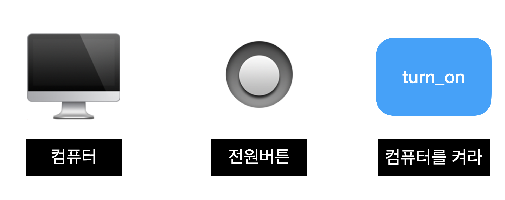

컴퓨터에는 대부분 🔘 이런 모양으로 생긴 전원 버튼이 있습니다. 우리는 그저 전원 버튼을 눌러서 전원을 켜거나 끄거나 하지만, 내부적으로는 그런 기능을 함수로 만들어서 사용하고 있습니다.

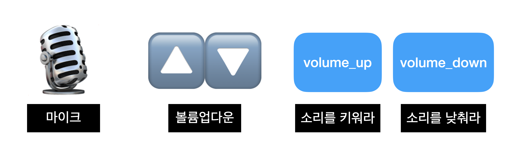

또한 마이크는 볼륨을 올리거나 내리거나 하는 기능이 있는 경우가 있습니다. 이 경우에 내부적으로 소리를 올리거나 내리거나 하는 함수를 만들어서 사용하게 됩니다.

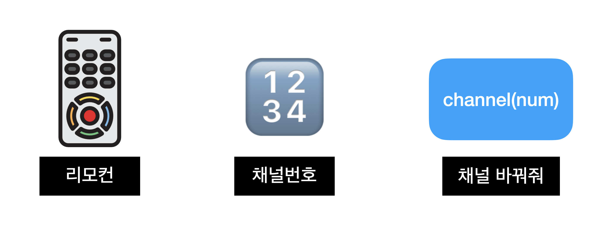

리모컨을 보면 채널을 지정하는 기능이 있습니다. 이때에는 채널의 번호를 누르면 해당 채널로 바뀌도록 하는 기능을 함수로 만들어 두었을 것입니다.

## 커피숍에서 알아보는 함수들

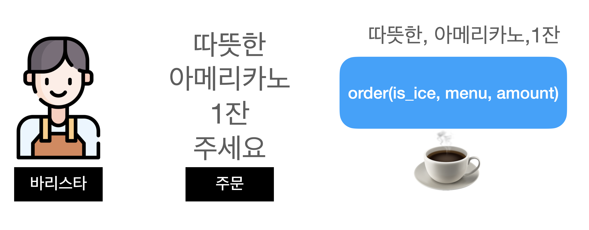

커피숍을 가보면 바리스타에게 보통 음료수를 주문하게 됩니다. '따뜻한 아메리카노 1잔 주세요' 라고 하죠. 이 기능을 만약에 컴퓨터로 만들게 된다면 따뜻한 것인지 차가운 것인지, 메뉴는 무엇인지, 수량은 얼마인지 전달을 해줘야합니다.

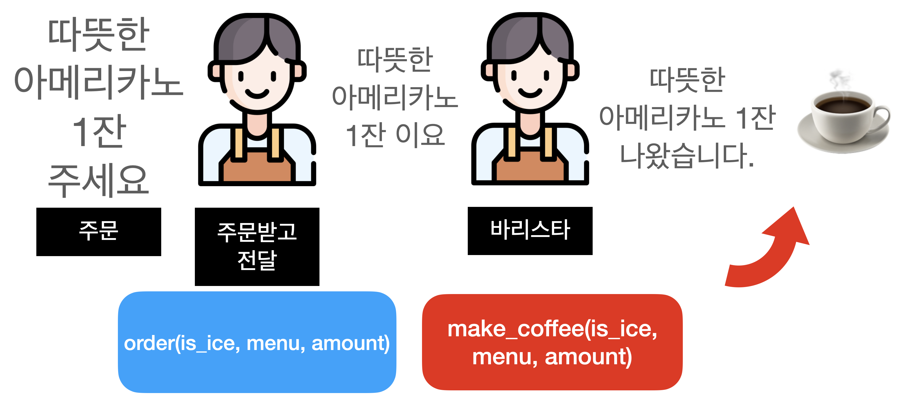

조금 큰 커피숍을 가게되면, 주문을 받는 사람이 있고, 주문에 따라 커피를 만드는 사람이 따로 있는 경우가 많이 있습니다. 이 때에는 주문을 하는 기능과 커피를 만드는 기능이 따로 있어야 됩니다.

## 함수 맞추기 1

이처럼 함수는 하고 싶은 일을 좀 더 객관화 수치화 할 수 있도록 해는 추상적인 장치라고 할 수 있습니다. 다음으로는 조금 더 코드로 만들 수 있는 내용으로 같이 알아보겠습니다.

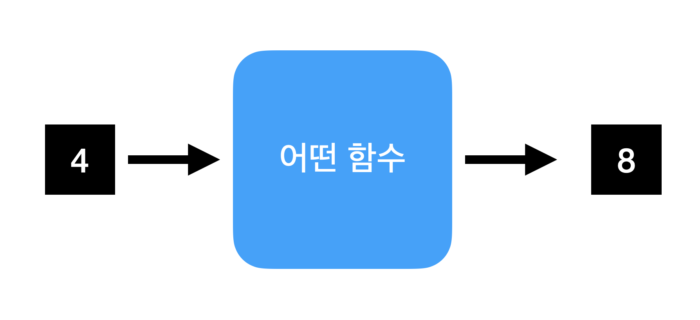

어떤 함수에 4를 넣었더니 8이 되었습니다. 이 함수는 어떤일을 하는 함수일까요?

4를 더해주는 함수이거나 2를 곱해주는 함수일 것 같습니다. 다른 값을 한번더 넣어보도록 하겠습니다.

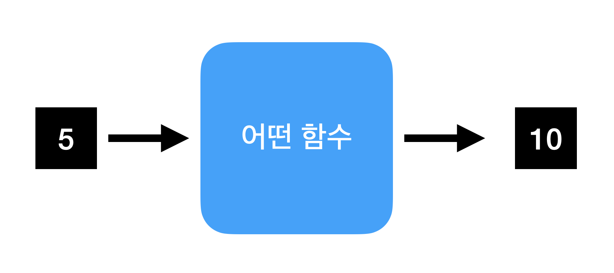

5를 넣었더니 10이 되었네요. 이 함수는 `주어진 값에 2를 곱해서 돌려주는 함수`입니다.

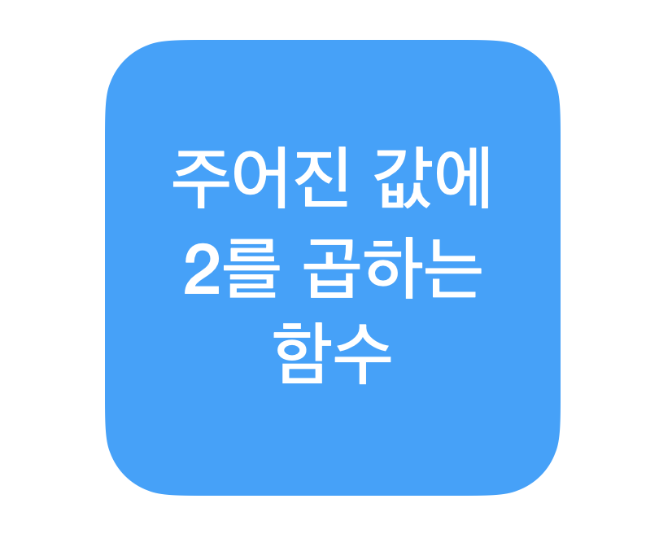

## 함수 맞추기 2

이번에는 빨간상자의 함수를 한번 보도록 하겠습니다.

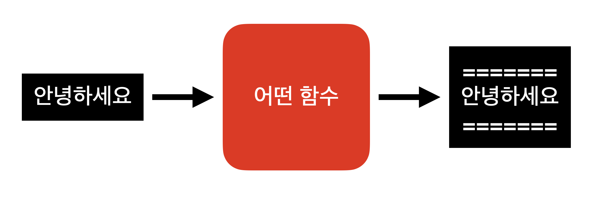

이 함수는 글자를 받아서 위아래로 `=====` 을 넣어주는 함수입니다.

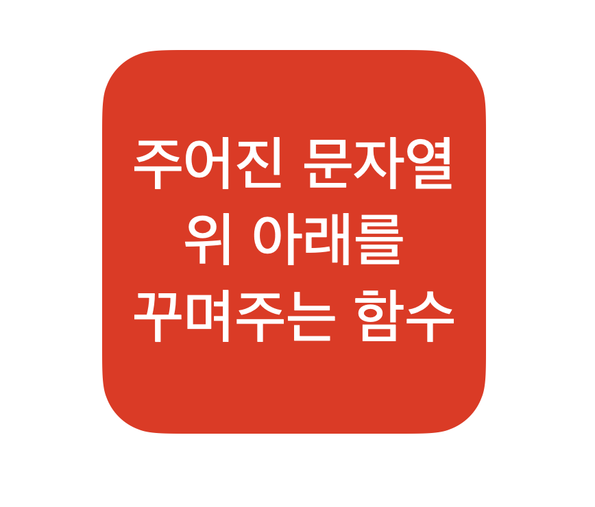

## 함수 합성하기

이번에는 두 함수를 합성했을 때 어떤 결과가 나올지 예측을 해보도록 합시다.

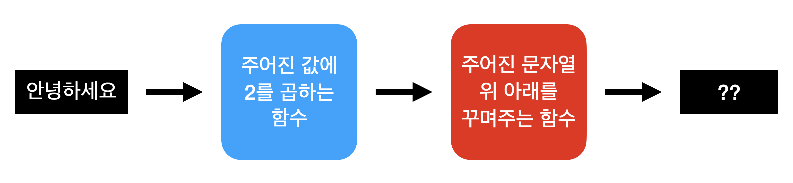

우선 `안녕하세요`에 2를 곱하면 어떤 일이 생기게 될까요? 파이선 세계에서는 문장(문자열)에 곱하기를 할 수 있습니다.

아래와 같은 파이썬 코드가 있을 때 결과가 어떻게 나올지 잠깐 살펴보도록합시다.

```python
text = '안녕하세요'
text * 2

# 스스로 결과를 확인해봅시다! ^_^
```

확인 해보신 분은 아시겠지만, `안녕하세요안녕하세요` 가 나오게 됩니다. 문자열이 두번 반복되는 것이죠. 그렇다면 합성된 함수의 결과는 아래와 같을 것입니다.

```python
=====
안녕하세요안녕하세요
=====
```

네 정답은 아래와 같이 됩니다.
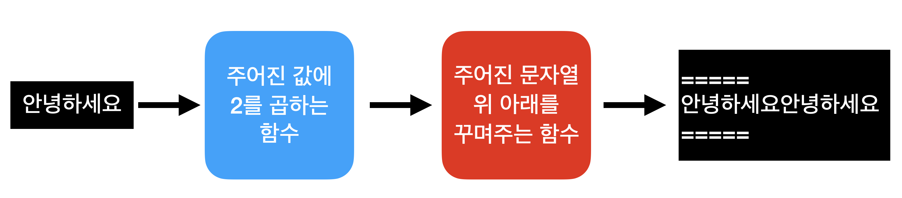

이 과정을 파이썬 코드로 한번 옮겨 보도록 하겠습니다.

## 함수 만들어 보기

파이썬에서 함수는 처음 만들어 보는 분이 있으실 것이므로 간단하게 몇가지만 우선 설명드리겠습니다.

1. 함수는 정의를 해야만 사용할 수 있습니다.

함수의 정의는 `def` (define의 약자입니다.)이라는 키워드를 붙여서 할 수 있습니다. 인사말을 출력하는 `hello`라는 함수를 정의해 보도록 하겠습니다.

```python
def hello():
    pass
```

2. def 다음에는 함수 이름이 오게됩니다. 함수명은 영어의 소문자와 숫자로만 짓는 것이 관례입니다. 다음과 같이 한글로도 함수이름을 지을 수 있습니다만, 권장하지는 않습니다.

```python
# 한글로도 함수명을 지을 수 있습니다. `def`는 바꿀 수 없어요~
def 안녕():
    pass
```

> `pass`는 어떤의미인가요? pass는 아무것도 실행하지 않고 그냥 통과(pass)시킵니다. 함수의 이름은 정했는데, 수행할 내용을 아직 정하지 않은 경우에 더러 쓰이게 됩니다.

> 함수이름 다음의 괄호 `()`는 뭔가요? 괄호안에는 파라메터(인자)들이 들어가게 됩니다. 파라메터는 함수에 넘길 수 있는 값을 의미하게 됩니다. 위에서 만든 함수는 인자 값이 없기 때문에 빈괄호만 넣어준 것입니다. 아래의 예제에서 인자가 있는 함수도 만들어보겠습니다.

함수 알아보기에서 나왔던 함수들을 만들어 보도록 하겠습니다.

**받은 값에서 2를 곱하는 함수**

```python
def multiply2(val):
    return val * 2
```

이름은 multiply2 이며 인자값으로 val 이라는 변수를 받고 있습니다. 그리고 이름과 같이 곱하기2를 해서 다시 결과를 돌려주는 코드입니다.

**문자열의 위아래를 꾸미는 함수**

```python
def decorate_text(val):
    return f"""=====
{val}
====="""
```

`decorate_text`는 문자열을 꾸며주는(decorate) 함수입니다. 인자값으로 val을 받고 있으며, `====`을 위 아래로 붙여서 결과값을 돌려주고 있습니다. f""" 으로 시작하는 문법은 f-string이라고 부르며 섹션4에서 다루게 됩니다. 지금은 그냥 문자열안에 변수를 넣을 수 있게 해주는 문법으로 이해하고 계시면 됩니다.

**`안녕하세요`를 두 함수에 넘겨서 값을 받기**

```python
txt = "안녕하세요"
print(decorate_text(multiply2(txt)))

# 결과값
=====
안녕하세요안녕하세요
=====
```

함수의 장점은 재사용과 확장성입니다. 만들어보았던 multiply2와 decorate_text 함수를 둘다 사용해서 결과값을 돌려받았습니다. 함수의 재사용을 늘리기 위해서는 하나의 일을 잘하는 함수를 만드는 것이 좋습니다 .
